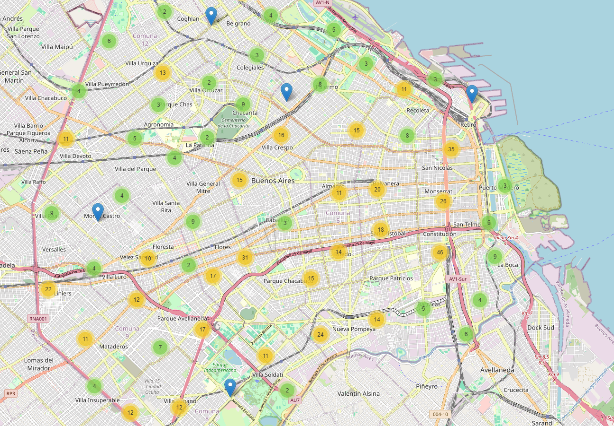

# HENRY-DATA-ANALYTICS-PI2
 ANALYTICS SINIESTROS VIALES BUENOS AIRES

 # Análisis de Siniestros Viales en la Ciudad de Buenos Aires (CABA)



## Índice

- [Descripción del Proyecto](#descripción-del-proyecto)
- [Estructura del Repositorio](#estructura-del-repositorio)
- [Descripción de los Datasets](#descripción-de-los-datasets)
- [Análisis Exploratorio de Datos (EDA)](#análisis-exploratorio-de-datos-eda)
  - [Limpieza de Datos](#limpieza-de-datos)
  - [Visualizaciones Generadas](#visualizaciones-generadas)
- [Dashboard Interactivo en Power BI](#dashboard-interactivo-en-power-bi)
  - [Métricas y KPIs](#métricas-y-kpis)
  - [Conclusiones y Recomendaciones](#conclusiones-y-recomendaciones)
- [Tecnologías Utilizadas](#tecnologías-utilizadas)
- [Cómo Utilizar el Repositorio](#cómo-utilizar-el-repositorio)
- [Contacto](#contacto)
- [Licencia](#licencia)

---

## Descripción del Proyecto

Este proyecto es el segundo trabajo del **Bootcamp de Ciencia de Datos de Henry**. Se divide en dos partes principales:

1. **Análisis Exploratorio de Datos (EDA):** Preparación, limpieza y análisis de los datasets de siniestros viales en la Ciudad de Buenos Aires (CABA), Argentina.
2. **Dashboard Interactivo en Power BI:** Creación de un dashboard interactivo que visualiza métricas clave, tendencias históricas y KPIs para monitorear la seguridad vial en CABA.

El objetivo principal es analizar los siniestros viales y desarrollar herramientas que permitan monitorear y reducir la incidencia de accidentes, especialmente aquellos que resultan en fatalidades.

---

## Estructura del Repositorio


### Descripción de las Carpetas y Archivos

- **EDA/**
  - `hechos.csv`: Dataset original de siniestros viales.
  - `victimas.csv`: Dataset original de víctimas involucradas en los siniestros.
  - `EDA.ipynb`: Notebook de Jupyter que contiene el análisis exploratorio y la limpieza de datos.
  - `cleaned_hechos.csv`: Dataset limpio de siniestros, preparado para su uso en Power BI.
  - `cleaned_victimas.csv`: Dataset limpio de víctimas, preparado para su uso en Power BI.
  - `image.png` y `image-1.png`: Mapas generados que visualizan la ubicación de los siniestros viales en CABA.
  - `mapa_siniestros.html`: Mapa interactivo creado con la librería Folium para visualizar siniestros en el navegador.

- **POWER BI/**
  - `cleaned_hechos.csv`: Dataset limpio de siniestros listo para Power BI.
  - `cleaned_victimas.csv`: Dataset limpio de víctimas listo para Power BI.
  - `Reporte_SiniestrosViales.pbix`: Archivo del dashboard interactivo desarrollado en Power BI.

---

## Descripción de los Datasets

### Dataset `hechos.csv`

Contiene información detallada sobre cada siniestro vial registrado en CABA. Los campos principales incluyen:

- **ID:** Identificador único del siniestro.
- **N_VICTIMAS:** Número de víctimas involucradas.
- **FECHA:** Fecha del siniestro.
- **AAAA, MM, DD:** Año, mes y día del siniestro.
- **HORA, HH:** Hora del siniestro.
- **LUGAR_DEL_HECHO:** Descripción del lugar del siniestro.
- **TIPO_DE_CALLE, Calle, Altura, Cruce:** Información detallada de la ubicación.
- **COMUNA:** Comuna de CABA donde ocurrió el siniestro.
- **XY (CABA), pos x, pos y:** Coordenadas geográficas del siniestro.
- **PARTICIPANTES, VICTIMA, ACUSADO:** Roles de los involucrados.

### Dataset `victimas.csv`

Contiene información sobre las víctimas de los siniestros viales. Los campos principales incluyen:

- **ID_hecho:** Identificador del siniestro (relacionado con `hechos.csv`).
- **FECHA:** Fecha del siniestro.
- **AAAA, MM, DD:** Año, mes y día del siniestro.
- **ROL:** Rol de la víctima (e.g., conductor, pasajero acompañante).
- **VICTIMA:** Tipo de víctima (e.g., moto, auto).
- **SEXO:** Sexo de la víctima.
- **EDAD:** Edad de la víctima.
- **FECHA_FALLECIMIENTO:** Fecha de fallecimiento de la víctima, si aplica.

---

## Análisis Exploratorio de Datos (EDA)

El análisis exploratorio de datos se realizó utilizando Jupyter Notebook (`EDA.ipynb`) y consistió en las siguientes etapas:

### Limpieza de Datos

1. **Importación de Datos:**
   - Cargado de los datasets originales `hechos.csv` y `victimas.csv` desde Google Drive.

2. **Limpieza y Preparación:**
   - Eliminación de duplicados.
   - Manejo de valores nulos y datos inconsistentes.
   - Normalización de formatos de fechas y categorías.
   - Creación de datasets limpios `cleaned_hechos.csv` y `cleaned_victimas.csv` para su posterior uso en Power BI.

3. **Análisis de Relaciones:**
   - Unión de datasets mediante `ID_hecho` para analizar la relación entre siniestros y víctimas.

### Visualizaciones Generadas

- **Mapas de Siniestros Viales:**
  - `image.png` y `image-1.png`: Visualizaciones estáticas que muestran la distribución geográfica de los siniestros en CABA.
  - `mapa_siniestros.html`: Mapa interactivo creado con la librería Folium, permitiendo una exploración dinámica de los siniestros en el navegador.


---

## Dashboard Interactivo en Power BI

El dashboard interactivo fue desarrollado utilizando Power BI y se encuentra en la carpeta `POWER BI/`. El archivo principal es `Reporte_SiniestrosViales.pbix`.

### Métricas y KPIs

Se desarrollaron varias métricas y dos KPIs principales para monitorear la evolución de los siniestros viales:

1. **Total Homicidios en Últimos 6 Meses:**
   - **Descripción:** Cuenta el número de homicidios en siniestros viales en los últimos seis meses.
   - **Cálculo:** Uso de funciones DAX para filtrar y contar los siniestros fatales.

2. **Total Homicidios Semestre Anterior:**
   - **Descripción:** Cuenta el número de homicidios en siniestros viales del semestre anterior al actual.
   - **Cálculo:** Similar al anterior, pero ajustando el rango de fechas.

3. **Tasa de Homicidios en Últimos 6 Meses:**
   - **Descripción:** Calcula la tasa de homicidios por cada 100,000 habitantes.
   - **Fórmula:** `(Número de homicidios / Población total) * 100,000`

4. **Tasa de Homicidios Semestre Anterior:**
   - **Descripción:** Calcula la tasa de homicidios del semestre anterior por cada 100,000 habitantes.

5. **Meta de Reducción:**
   - **Descripción:** Define la meta de reducción del 10% respecto al semestre anterior.

6. **Cumplimiento de Reducción:**
   - **Descripción:** Indica si se ha alcanzado la meta de reducción de homicidios.

### KPIs Adicionales

1. **Reducción de Accidentes Mortales de Motociclistas:**
   - **Objetivo:** Reducir en un 7% la cantidad de accidentes mortales de motociclistas en el último año respecto al año anterior.
   - **Fórmula:** `((Accidentes Año Anterior - Accidentes Año Actual) / Accidentes Año Anterior) * 100`

### Visualizaciones Clave

- **Tarjetas de Métricas:**
  - Mostrar valores clave como tasas de homicidios, metas de reducción, y cumplimiento de objetivos.

- **Gráficos Comparativos:**
  - Comparación de tasas de homicidios entre diferentes periodos.
  
- **Mapas Interactivos:**
  - Visualización geográfica de los siniestros viales en CABA.

- **Conclusiones y Recomendaciones:**
  - Sección dedicada a resumir hallazgos clave y proponer acciones para mejorar la seguridad vial.

---

## Conclusiones y Recomendaciones

El análisis y la creación del dashboard han permitido identificar tendencias y áreas críticas en la seguridad vial de CABA. Las principales conclusiones incluyen:

- **Reducción de Homicidios en Siniestros Viales:**
  - Se logró una reducción significativa en la tasa de homicidios en siniestros viales en los últimos seis meses, cumpliendo con la meta del 10%.

- **Reducción de Accidentes Mortales de Motociclistas:**
  - Se avanzó hacia la meta de reducción del 7% en accidentes mortales de motociclistas, destacando la necesidad de continuar con medidas de prevención y concientización.

**Recomendaciones:**

1. **Implementación de Medidas de Seguridad:**
   - Fortalecer la infraestructura vial y mejorar la señalización en áreas con alta incidencia de siniestros.

2. **Campañas de Concientización:**
   - Desarrollar campañas dirigidas a motociclistas y conductores para promover prácticas de conducción segura.

3. **Monitoreo Continuo:**
   - Mantener un sistema de monitoreo constante mediante dashboards interactivos para evaluar la efectividad de las medidas implementadas.

---

## Tecnologías Utilizadas

- **Lenguajes y Herramientas:**
  - **Python:** Para el análisis y limpieza de datos (Jupyter Notebook).
  - **Pandas, NumPy:** Bibliotecas de Python para manipulación de datos.
  - **Folium:** Librería de Python para la creación de mapas interactivos.
  - **Power BI:** Para la creación de dashboards interactivos y visualizaciones avanzadas.

- **Plataformas:**
  - **Google Drive:** Almacenamiento de datasets originales.
  - **GitHub:** Gestión de versiones y alojamiento del repositorio del proyecto.

---

## Cómo Utilizar el Repositorio

### Requisitos

- **Python 3.8+**
- **Jupyter Notebook**
- **Librerías de Python:**
  - pandas
  - numpy
  - folium
- **Power BI Desktop**

### Pasos para Reproducir el Análisis

1. **Clonar el Repositorio:**
   ```bash
   git clone https://github.com/ArtiomDiakov/HENRY-DATA-ANALYST.git

2. **Navegar a la Carpeta:**
    ```bash
    cd repositorio_clonado/EDA

3. **Instalar Dependencias de Python:**
    ```bash
    pip install pandas numpy folium
4. **Abrir y correr el jupiter script de Python:**
    python EDA.ipynb